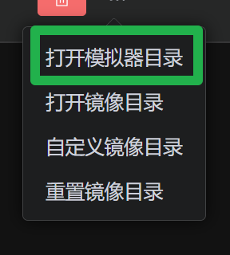
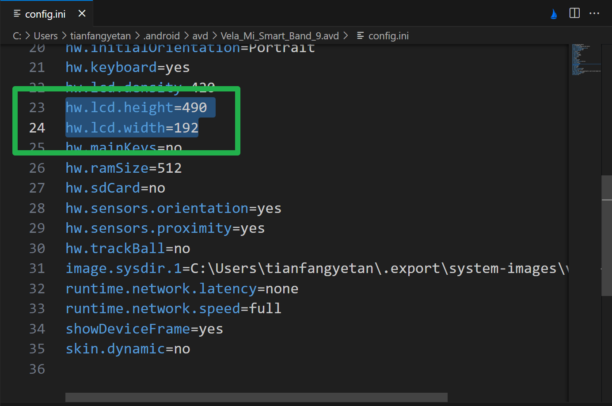
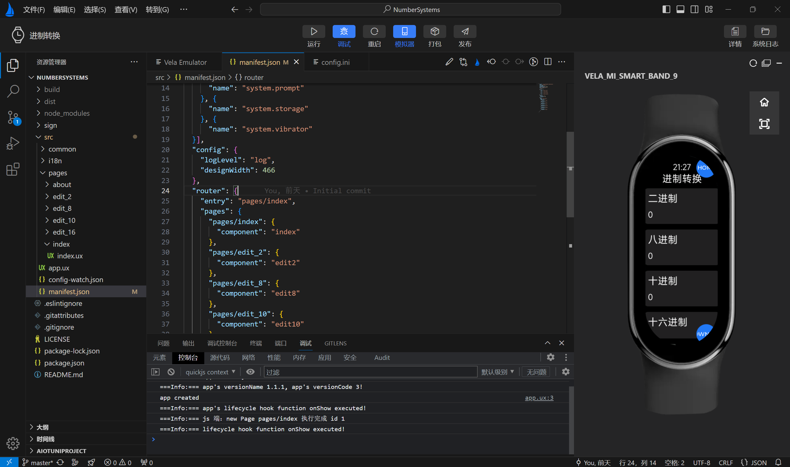

# NumberSystems

适用于小米手环9的进制转换程序

## 模拟器使用

1. 新建一个虚拟机，用任意项目（示例项目）运行一遍

2. 进入虚拟机目录

3. 修改分辨率

4. 运行项目

## 注意事项

- 设置[页面基准宽度](https://iot.mi.com/vela/quickapp/zh/content/framework/manifest.html#config)

  - 运行或打包前请将 `src\manifest.json` 中的 `config.designWidth` 修改为需要的数值（单位：像素）

  - 在模拟器中运行项目前请修改为 `466` （小米手表s3的宽度）

  - 打包项目前请修改为 `192` （小米手环9的宽度）

- JavaScript中整数的最大安全值是 $2 ^{53} - 1$ ，小米的框架似乎不支持 `Bigint` ，所以有最大值限制
