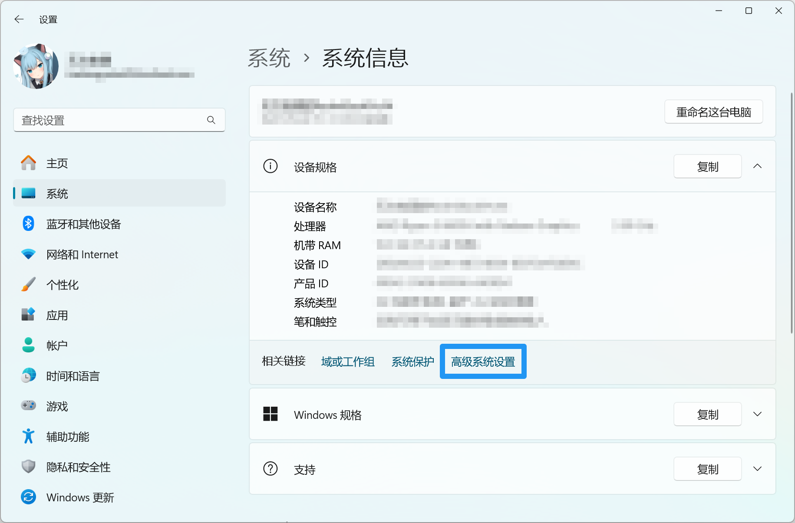
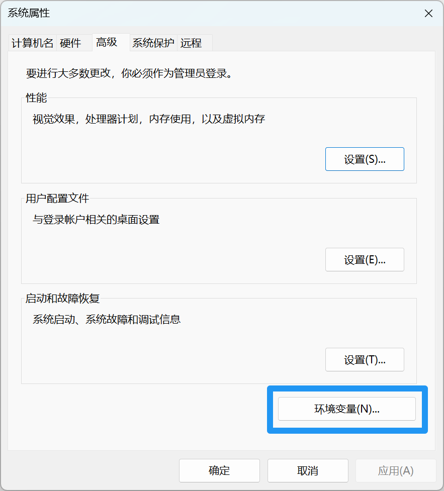
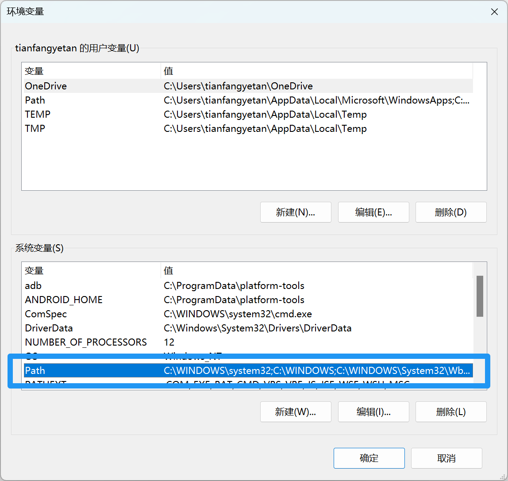
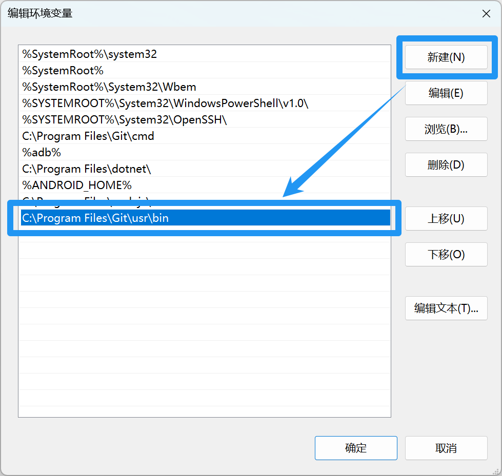

# Base Number Converter for Mi Band 9

[](https://github.com/tianfangyetan1/NumberSystems_MiBand9/releases)
[](https://github.com/tianfangyetan1/NumberSystems_MiBand9/blob/master/LICENSE)
[](https://www.bandbbs.cn/threads/12425/)

适用于小米手环9的进制转换程序

## 模拟器使用

1. 新建一个模拟器，用任意项目（示例项目）运行一遍
2. 打开模拟器目录，找到配置文件 `Vela_模拟器名称.avd\config.ini`
3. 修改分辨率：`config.ini` 第23-24行
    ```ini
    hw.lcd.height=490
    hw.lcd.width=192
    ```
4. 运行项目
    <details>
      <summary>模拟器运行效果</summary>

      
    </details>
    
## 页面基准宽度

- [官方文档说明](https://iot.mi.com/vela/quickapp/zh/content/framework/style/page-style-and-layout.html#px)
- 运行或打包前请将 `src\manifest.json` 中的 `config.designWidth` 修改为需要的数值（单位：像素）
- 在模拟器中运行项目请修改为 `466` （小米手表s3的宽度）
- 打包项目至真机运行请修改为 `192` （小米手环9的宽度）

## 关于 [OpenSSL](https://openssl.org/)

- OpenSSL 官方不提供打包后的二进制文件
- git 安装时附有 OpenSSL

### 安装步骤

> 来源： [ssl - How to install OpenSSL in windows 10? - Stack Overflow](https://stackoverflow.com/questions/50625283/how-to-install-openssl-in-windows-10)

1. 安装 [git](https://git-scm.com)
2. 找到 `openssl.exe` 的路径，例如 `C:\Program Files\Git\usr\bin`
3. 将该路径添加至 path 环境变量
    <details>
      <summary>查看详情</summary>

      

      

      

      
      
    </details>

## 注意事项

- JavaScript中整数的最大安全值是 $2 ^{53} - 1$ ，小米的框架似乎不支持 `Bigint` ，所以有最大值限制
